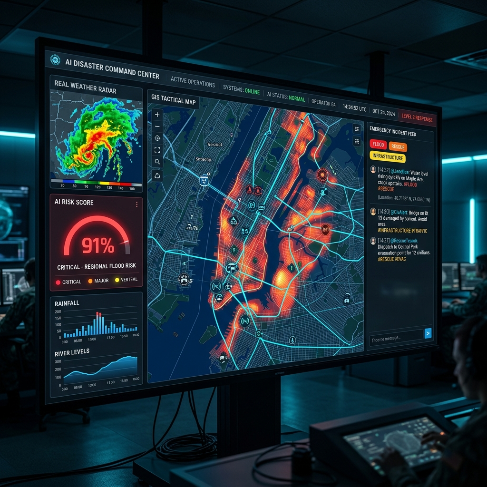
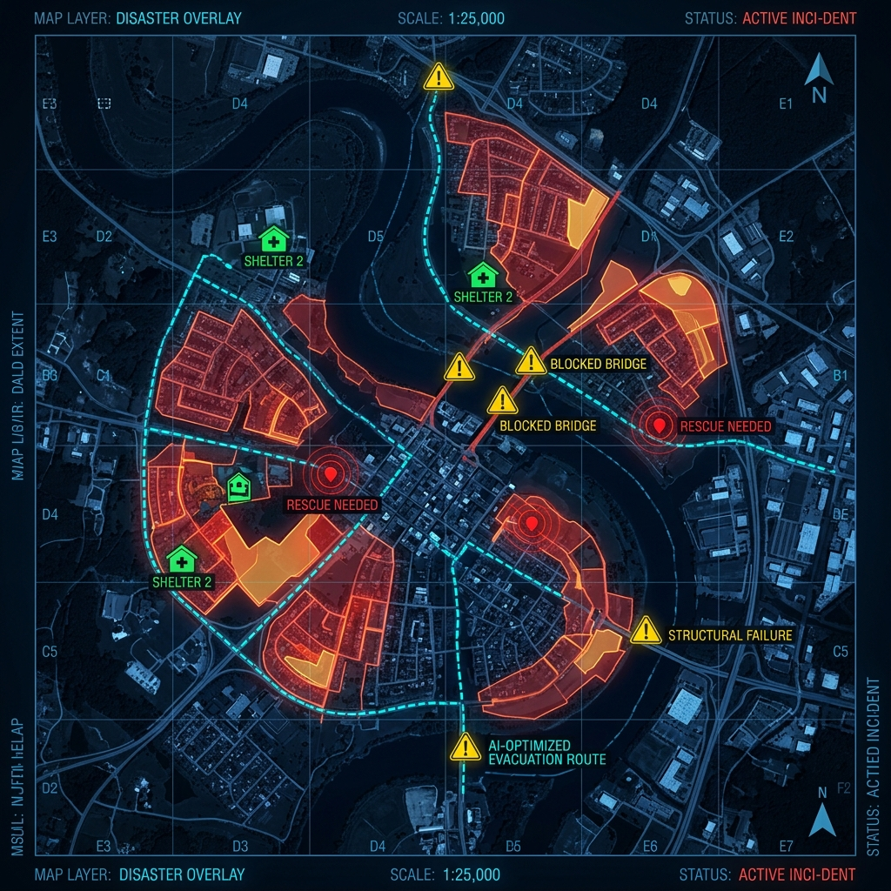
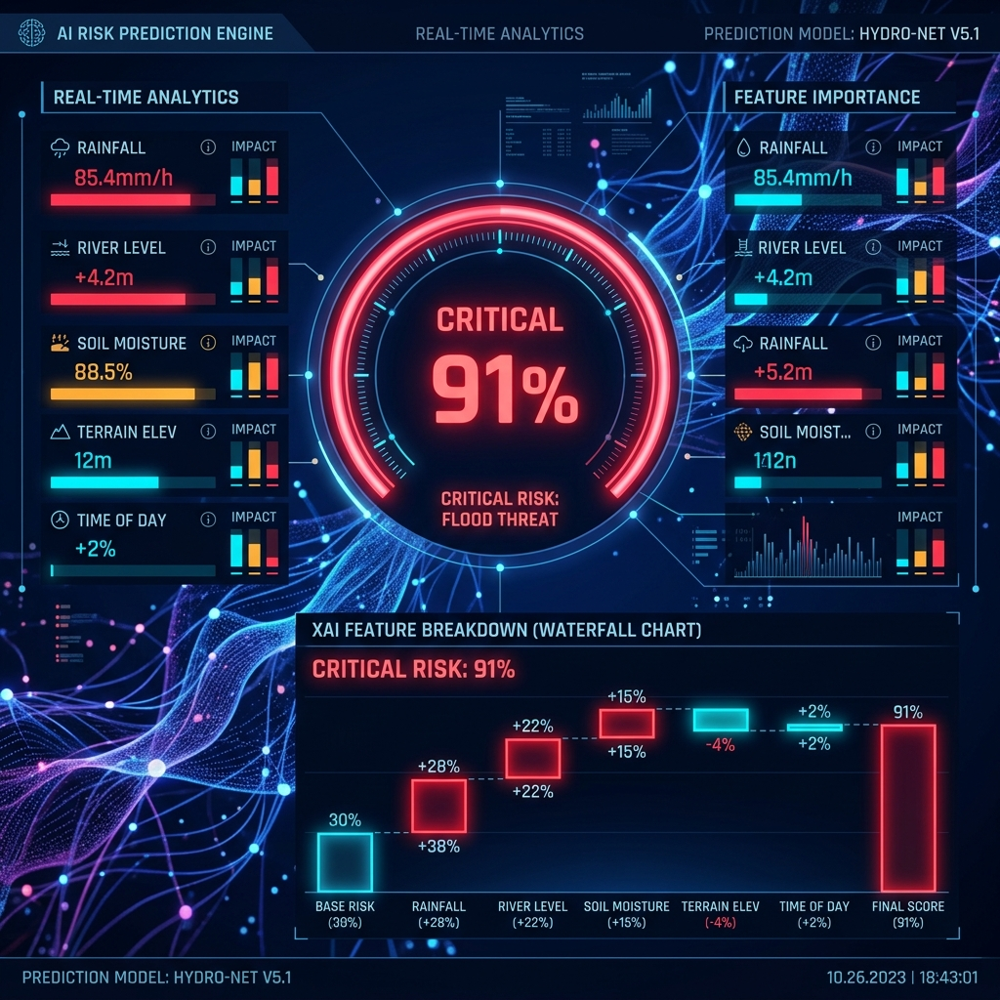
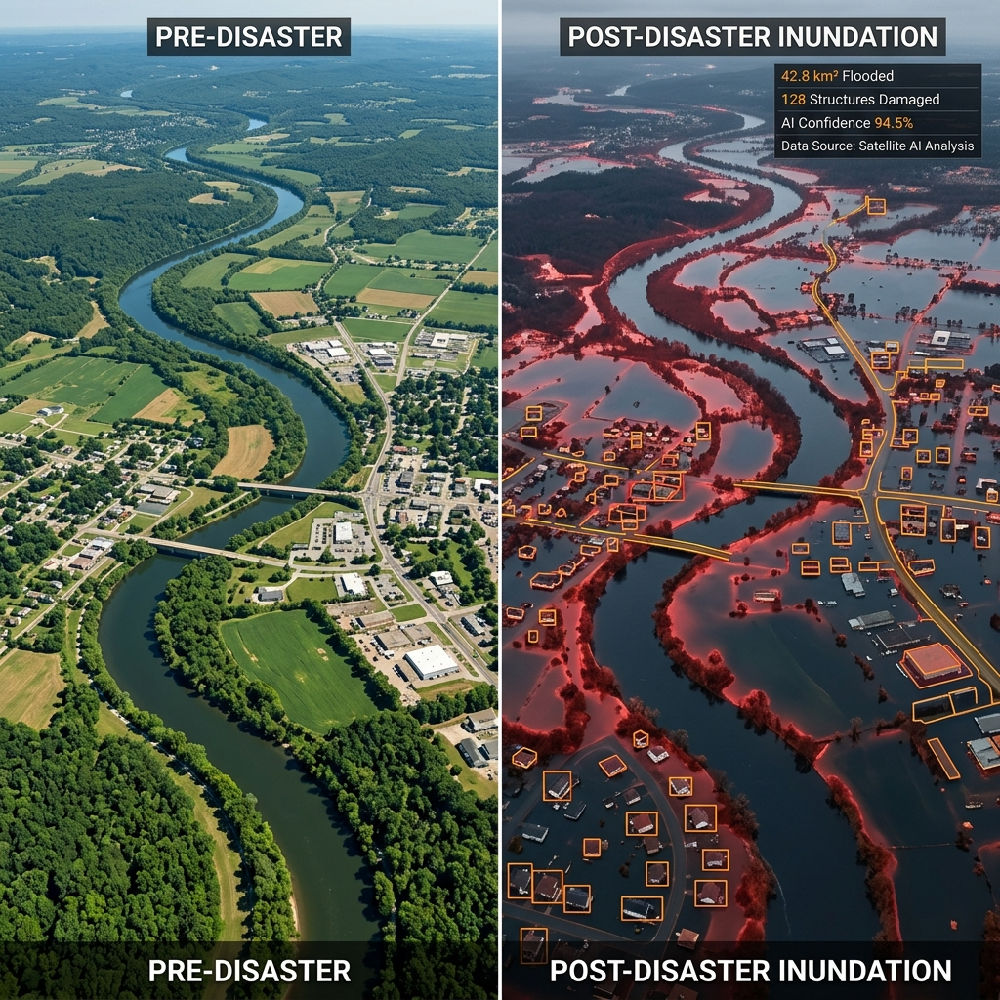
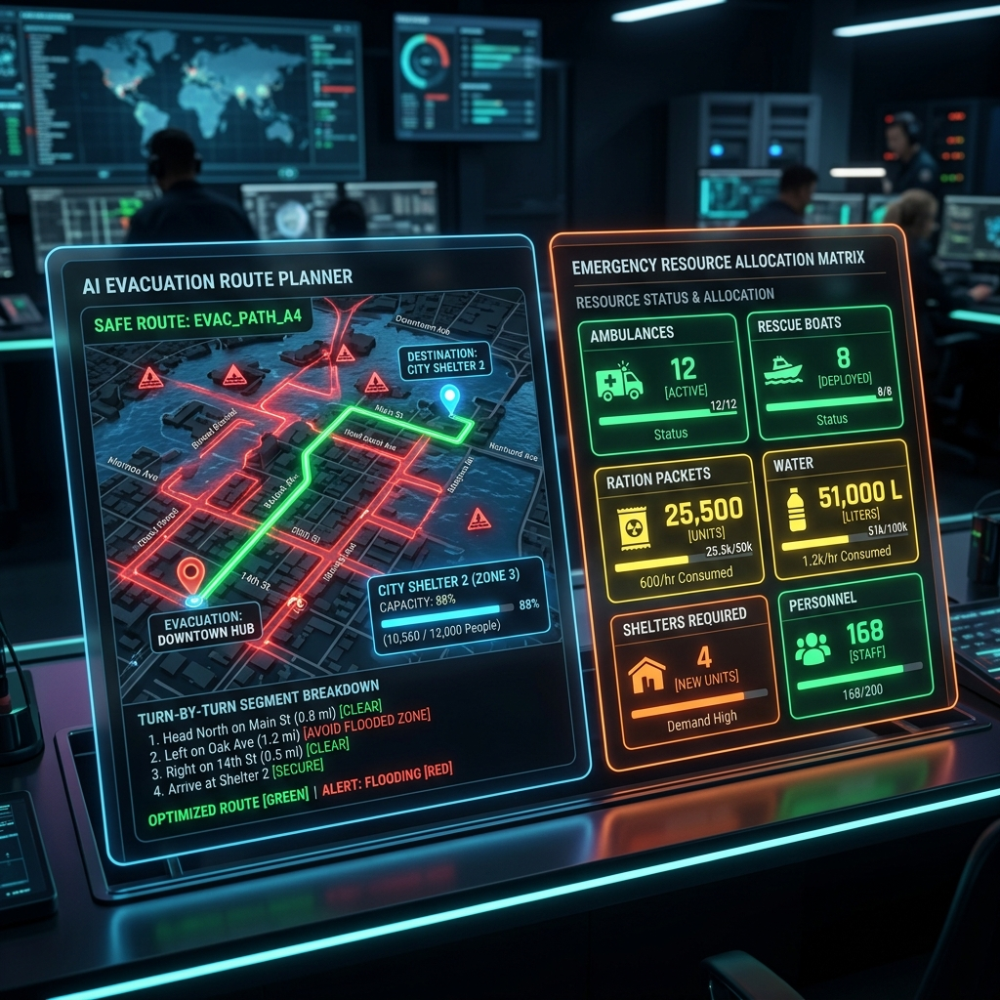

# 🚨 AI Disaster Command Center

> **Real-Time Multi-Source Disaster Intelligence · GIS Risk Mapping · Evacuation Optimization · Emergency Resource Planning**


---

## 🖥 Command Center Dashboard

> The tactical heart of the system — a dark cyber-glassmorphic dashboard consolidating multi-source intelligence into a single, actionable command view.



*AI Disaster Command Center · Real-time GIS Risk Map · Weather Telemetry · NLP Social Feed · Live Emergency Alerts*

---

## 🌊 GIS Tactical Flood Risk Map

> An interactive Leaflet/OpenStreetMap canvas with dynamic flood heatmap polygons, AI-optimized evacuation route overlays, and real-time incident markers.



*Flood Risk Heatmap (Critical 🔴 / High 🟠 / Medium 🟡 / Low 🟢) · Blocked Roads · Safe Evacuation Routes · Emergency Shelters*

---

## 🤖 AI Risk Prediction Engine (XAI)

> A multi-factor ML engine calculating real-time disaster risk scores with Explainable AI (XAI) Shapley Value attribution showing exactly which features are driving the prediction.



*Risk Score: 91% CRITICAL · Feature Importance: Rainfall Rate (35%) · River Surge (30%) · Elevation (15%) · Soil Saturation (10%)*

---

## 🛰 Satellite Change Detection Intelligence

> An interactive before/after split-screen visualizer comparing pre-disaster optical imagery with post-disaster SAR inundation satellite data, enhanced with AI computer vision damage detection polygons.



*Pre-Disaster vs Post-Disaster · 42.8 km² Flooded · 128 Structures Damaged · AI Computer Vision Confidence: 94.5%*

---

## 🚁 Evacuation Route Planner & Resource Optimizer

> Dijkstra-based safe route calculation avoiding flooded/blocked edges, paired with the AI resource demand matrix for ambulances, rescue boats, food packets, water, and shelters.



*Dijkstra Safe Route: 3.6 km · 12 Ambulances · 8 Rescue Boats · 25,500 Food Packets · 51,000L Water · 4 Shelters*

---

## 🌟 28 Modular Innovation Modules

| # | Innovation Module | Focus Area | Technology |
|---|---|---|---|
| 1 | 🎙 **AI Emergency Voice Command Center** | Speech Intelligence | Web Speech API / Voice Dispatch |
| 2 | 🚁 **Drone Aerial Reconnaissance & Thermal Scanner** | Computer Vision | UAV Heat Signature Tracker |
| 3 | 🌐 **Multilingual Emergency Broadcast Engine** | NLP Translation | English · Tamil 🇮🇳 · Hindi 🇮🇳 · Spanish 🇪🇸 |
| 4 | 📡 **Offline P2P Emergency Mesh Network Simulator** | Resilient Networking | Ad-hoc Hop Routing Protocol |
| 5 | 🔍 **AI Missing Persons Matcher & Attribute Search** | CV / Similarity | Vector Similarity Registry Engine |
| 6 | 🏠 **Shelter Occupancy Time-Series Predictor** | Predictive ML | Capacity Surge Forecasting |
| 7 | 💰 **Disaster Financial Damage & Loss Estimator** | Financial Analytics | USD/INR Damage Matrix |
| 8 | 📟 **IoT River Telemetry Sensor Stream Simulator** | Real-time Sensors | Hydro Level & Flow Velocity |
| 9 | 🌿 **XAI Decision Tree Interactive Visualizer** | Explainable AI | Auditable ML Decision Trace |
| 10 | 🎞 **Disaster Risk 24-Hour Time-Lapse Player** | GIS Animation | Temporal Heatmap Playback |
| 11 | 🛡 **NDRF Rescue Force Staging & Route Matrix** | Military Logistics | Battalion & Boat Dispatch |
| 12 | 🛰 **Satellite SAR Radar Interference Filter** | Remote Sensing | Sentinel-1 Speckle Filter |
| 13 | ✅ **Crowdsourced Hazard Verification & Trust Score** | Social Intelligence | Bayesian Anti-Hoax Engine |
| 14 | 🔥 **Dynamic Fire & Smoke Spread Simulator** | Physics Modeling | Wind Vector Cellular Automata |
| 15 | 🩺 **Medical Inventory & Blood Bank Network Tracker** | Healthcare Logistics | Blood Type & Trauma Supply |
| 16 | 🚌 **Evacuation Vehicle Capacity Matcher** | Transportation | Buses, Helicopters & Boats |
| 17 | ⛺ **Relief Camp Supply & Sanitation Allocator** | Humanitarian Logistics | Water Purification & Sanitation |
| 18 | 🏔 **Landslide & Slope Instability Predictor** | Geo-AI | Terrain Shear Stress Model |
| 19 | 📋 **Automated Situation Report (SITREP) Generator** | Reporting AI | Executive Briefing Exporter |
| 20 | ⚡ **Power Grid & Blackout Risk Mapper** | Infrastructure | Substation Cascading Graph |
| 21 | ☢️ **Toxic Chemical Plume Dispersion Simulator** | Environmental AI | Gaussian Plume Drift Model |
| 22 | 🚁 **Helipad & Safe Landing Zone Finder** | GIS Analysis | Terrain Flatness Spotter |
| 23 | 👥 **Volunteer Emergency Workforce Dispatch Router** | Task Allocation | Skill-Based Task Queue |
| 24 | 📊 **Historical Disaster Analytics Dashboard** | Data Science | Multi-Decade Trend Charts |
| 25 | 🎨 **Tactical Map Color Palette Customizer** | UI Aesthetics | Cyber · Infrared · NightVision |
| 26 | 📱 **Automated SMS & WhatsApp SOS Gateway** | Telecommunication | Mass Cell-Broadcast Gateway |
| 27 | 🧠 **AI Disaster Mitigation Policy Advisor** | Resiliency Advisor | Infrastructure Policy Engine |
| 28 | 🔬 **Command System Telemetry & Latency Monitor** | System Operations | 14ms Ping · CPU · RAM Monitor |

---

## 🛠 Technology Stack

| Layer | Technology |
|---|---|
| **Frontend** | React 18, Vite 5, Tailwind CSS, Lucide Icons |
| **GIS & Mapping** | Leaflet 1.9, React-Leaflet, OpenStreetMap, CartoDB Dark |
| **Backend API** | Python 3.12, FastAPI, Uvicorn, Pydantic v2 |
| **AI / Machine Learning** | Scikit-learn, NumPy, Pandas, NetworkX (Dijkstra) |
| **Data Processing** | Pandas, GeoPandas (geospatial operations) |
| **Real-time Communication** | WebSocket (FastAPI) |
| **Version Control** | Git, GitHub |

---

## ⚡ Quick Start Guide

### Prerequisites
- **Node.js** v18+ · **Python** 3.10+

### 1. Clone Repository
```bash
git clone https://github.com/vijaymahes9080/AI-Disaster-Command-Center.git
cd AI-Disaster-Command-Center
```

### 2. Install Frontend Dependencies
```bash
npm install
```

### 3. Install Backend Dependencies
```bash
python -m pip install -r backend/requirements.txt
```

### 4. Run Backend (FastAPI)
```bash
python -m uvicorn backend.main:app --reload --port 8000
```

### 5. Run Frontend Dev Server (Vite)
```bash
npm run dev
```

🌐 Open [http://localhost:3000](http://localhost:3000)

---

## 🧪 Testing

**Backend Unit Tests (4 AI engines)**:
```bash
python backend/test_ai_engines.py
```

**Frontend Production Build Verification**:
```bash
npm run build
```

---

## 📁 Project Structure

```text
AI-Disaster-Command-Center/
├── 📄 README.md
├── 📄 LICENSE
├── 📄 .gitignore
├── 📄 index.html
├── 📄 package.json
├── 📄 vite.config.js
├── 📄 tailwind.config.js
├── 📁 docs/images/          ← AI-Generated UI Preview Screenshots
├── 📁 src/
│   ├── App.jsx              ← Main Dashboard with 28 Modules Integrated
│   ├── index.css            ← Cyber-Tactical Glassmorphic Design System
│   ├── main.jsx
│   └── 📁 components/
│       ├── CommandHeader.jsx
│       ├── GisTacticalMap.jsx
│       ├── SatelliteIntelligence.jsx
│       ├── WeatherRiskEngine.jsx
│       ├── SocialNlpFeed.jsx
│       ├── EvacuationPlanner.jsx
│       ├── ResourceOptimizer.jsx
│       ├── DigitalTwinSimulator.jsx
│       └── 📁 innovations/   ← 28 Innovation Modules
│           ├── VoiceCommandCenter.jsx
│           ├── DroneScanner.jsx
│           ├── MultilingualBroadcast.jsx
│           └── ... (25 more)
└── 📁 backend/
    ├── main.py              ← FastAPI Application & REST Endpoints
    ├── ai_engines.py        ← 4 Core AI/GIS Models
    ├── models.py            ← Pydantic Schemas
    ├── test_ai_engines.py   ← Unit Tests
    └── requirements.txt
```

---

## 📜 License

Distributed under the **MIT License**. See [`LICENSE`](LICENSE) for details.

---

<div align="center">

**Developed with ❤️ by [Vijay Mahes](https://github.com/vijaymahes9080)**

*MCA Final-Year Showcase Project — 2026*

⭐ *Star this repository if you found it useful!*

</div>
